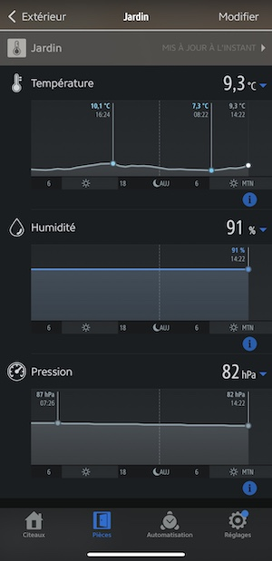

# homebridge-netro-whisperer

This [Homebridge](https://github.com/nfarina/homebridge) plugin can be used integrate your Netro Whisperer in your Home App.  
More info on the Netro Whisperer sensor: <https://netrohome.com/en/shop/products/whisperer>

It will add an accessory to the ***Home*** app that will provide the current temperature and humidity from the Netro Whisperer Sensor.  
In the ***Eve*** application, you will have access to the history graph of the temperature and humidity. In addition, the battery percentage (with history graph) will be available using the "Air Pressure" field.



(In this exemple, the current battery percentage is 82% (ie 82hPa..))

This plugin has been strongly inspired by these plugins, thansk to the developpers:

- <https://github.com/Supereg/homebridge-http-temperature-sensor>
- <https://github.com/Supereg/homebridge-http-humidity-sensor>
- <https://github.com/simont77/homebridge-weather-station-eve>

## Installation

First of all you need to have [Homebridge](https://github.com/nfarina/homebridge) installed. Refer to the repo for 
instructions.  
Then run the following command to install `homebridge-netro-whisperer`

```bash
    sudo npm install -g homebridge-netro-whisperer
```

## Serial number

For the configuration, you will need your Netro Whisperer ***serial number***.  
It can be find in the ***Netro App***, in `Setting->Sensors -> Serial Number`.  
**Please keep your serial number as secret as anyone with this key could access your Netro APIs.**  
(For more information see <https://netrohome.com/en/shop/articles/10>)

## Configuration

The plugin configuration should be added to the `accessories` section of the ***homebridge*** configuration file:

```json
 "accessories": [
    {
        "accessory": "netro-whisperer",
        "sensorSerial": "1234567",
        "name": "Netro Whisperer Sensor",
        "pullInterval": 30
    }
 ]
```

- `accessory` must be `"netro-whisperer"`
- `sensorSerial` the serial number of your Netro Whisperer (see [Serial number](#serial-number))
- `name` can we anything you want to identify your sensor in the **Home** or **Eve** app
- `pullInterval` the minimum time (in **minutes**) between calls to the Netro API. Otherwise the cached value will be reported. Default value is 30 minutes.

### Debug configuration

For debug purpose, this fields can be added to the configuration:

- `debug: true` to enable debug messages in the logs
- `apiUrl` to override the API URL. The default value is: `http://api.netrohome.com/npa/v1/sensor_data.json?key=`
